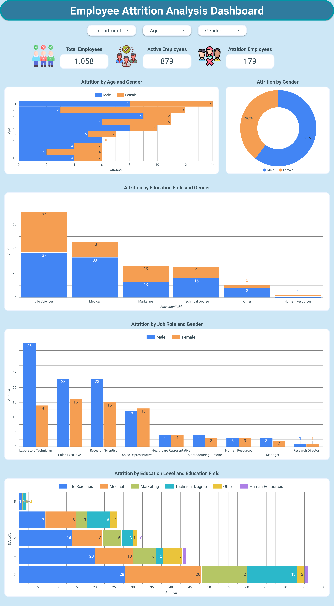
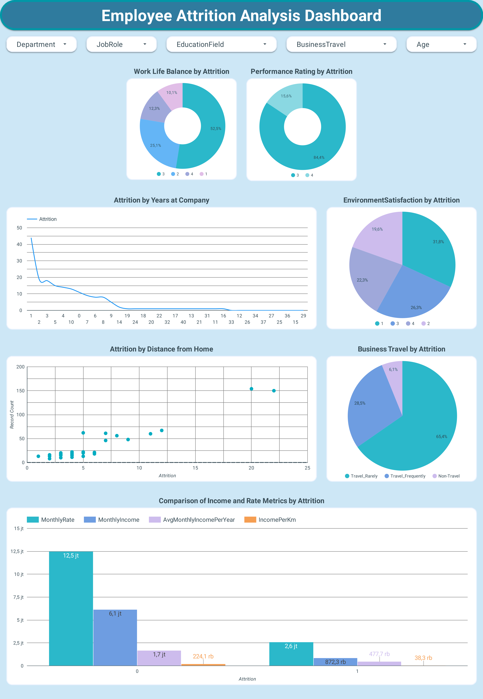
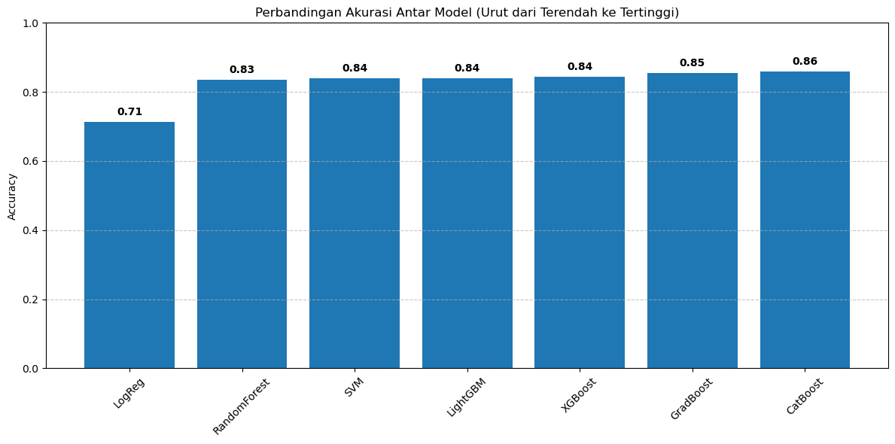

# **Proyek Akhir: Menyelesaikan Permasalahan Attrition Karyawan di Perusahaan Jaya Jaya Maju**

## **Business Understanding**

Jaya Jaya Maju adalah perusahaan multinasional yang telah berdiri sejak tahun 2000 dan memiliki lebih dari 1000 karyawan yang tersebar di seluruh Indonesia. Sebagai perusahaan yang cukup besar, Jaya Jaya Maju menghadapi tantangan signifikan dalam mengelola karyawan, yang tercermin dari tingginya attrition rate (rasio karyawan yang keluar dibandingkan total karyawan) yang mencapai lebih dari 10%.

Pendekatan berbasis data diperlukan untuk memahami pola attrition dan mengembangkan solusi yang dapat memitigasi risiko ini secara proaktif. Proyek ini akan memberikan insight yang actionable kepada  departemen Human Resources (HR) untuk mendukung pengambilan keputusan yang lebih baik.

### **Permasalahan Bisnis**
Jaya Jaya Maju menghadapi masalah tingginya *attrition rate* karyawan yang melebihi 10%. Kondisi ini menimbulkan kekhawatiran karena berdampak pada biaya operasional yang meningkat, penurunan produktivitas, dan ketidakstabilan organisasi. Departemen HR saat ini kesulitan memahami penyebab utama dari tingginya tingkat *attrition* ini dan membutuhkan solusi yang dapat membantu mereka mengelola masalah tersebut secara proaktif.

**Permasalahan Utama:**
- Belum diketahuinya faktor-faktor spesifik yang menyebabkan karyawan memilih untuk keluar dari perusahaan.
- Kurangnya alat atau sistem yang memungkinkan pemantauan berkala terhadap tren *attrition* dan faktor-faktor yang memengaruhinya.
- Dampak finansial dan operasional dari *attrition* yang tinggi belum dapat diminimalkan karena kurangnya wawasan berbasis data.

### **Cakupan Proyek**

Proyek ini mencakup beberapa tahapan utama untuk mengatasi permasalahan attrition:

1. **Business Understanding**  
   Memahami konteks bisnis dan dampak attrition terhadap perusahaan Jaya Jaya Maju .

2. **Data Understanding & Preparation**  
   Mengumpulkan dan mempersiapkan data karyawan, termasuk penanganan nilai hilang dan transformasi fitur.

3. **Exploratory Data Analysis (EDA)**  
   Menganalisis pola dan tren attrition berdasarkan variabel seperti usia, gaji, kepuasan kerja, dan lama bekerja.

4. **Modeling**  
   Membangun model prediktif seperti Logistic Regression, Random Forest, dan XGBoost untuk memprediksi risiko attrition.

5. **Evaluation**  
   Mengevaluasi performa model dengan metrik seperti akurasi, presisi, recall, F1-score, dan AUC-ROC.

6. **Script Prediction & Deployment Preparation**  
   Menyusun script prediksi otomatis dan menyimpan model terbaik untuk keperluan deployment.

7. **Dashboard Development**  
   Mengembangkan dashboard interaktif untuk memvisualisasikan insight dan metrik attrition secara real-time.

8. **Recommendation**  
   Memberikan rekomendasi strategis kepada  departemen Human Resources (HR) untuk meningkatkan retensi karyawan.


### **Persiapan Data**

#### 1. Sumber Dataset

- Dataset yang digunakan bersumber dari [ Employee Data (GitHub - Dicoding) ](https://github.com/dicodingacademy/dicoding_dataset/blob/main/employee/employee_data.csv). Dataset ini terdiri dari 1470 baris dan 35 kolom, mencakup informasi karyawan seperti:

   - **Age**: Usia karyawan.
   - **Attrition**: Variabel target (1 untuk karyawan yang keluar, 0 untuk yang tetap).
   - **MonthlyIncome**: Pendapatan bulanan karyawan.
   - **JobSatisfaction**: Tingkat kepuasan kerja.
   - **YearsAtCompany**: Lama bekerja di perusahaan.
   - **DistanceFromHome**: Jarak dari rumah ke tempat kerja.


#### 2. Setup Environment

- Buat dan aktifkan environment Conda:
  ```
  conda create -n attrition-env python=3.12.7 -y
  conda activate attrition-env
  ```

- Install dependensi:
  ```
  pip install -r requirements.txt
  ```

#### 3. Prediksi Attrition dengan Model

- Jalankan script prediksi:
  ```
  python employee_attrition.py
  ```

## **Business Dashboard**

### **Tujuan Dashboard**

- Memberikan gambaran menyeluruh tentang tingkat attrition.
- Menampilkan faktor kunci seperti usia, gaji, dan kepuasan kerja.
- Mendukung pengambilan keputusan strategis oleh departemen Human Resources (HR).

### **Visualisasi Dashboard**

Dashboard interaktif dibuat menggunakan Looker Studio, mencakup:
- Tren attrition dari waktu ke waktu.
- Distribusi attrition berdasarkan departemen.
- Korelasi antara kepuasan kerja dan attrition.

Lihat dashboard melalui tautan berikut:  
[](https://lookerstudio.google.com/reporting/a37815f8-7dd2-423e-a9bc-c761505877a5)





## **Kesimpulan**


Proyek ini berhasil mengidentifikasi faktor-faktor utama penyebab attrition karyawan di perusahaan Jaya Jaya Maju , seperti usia, gaji, dan kepuasan kerja. Model Random Forest yang dikembangkan memberikan prediksi akurat tentang karyawan yang berisiko keluar, sementara dashboard interaktif memungkinkan pemantauan real-time oleh departemen Human Resources (HR).

### **Hasil dan Temuan**
- **Faktor Utama Attrition**: Usia, gaji bulanan, kepuasan kerja, dan lama bekerja adalah pendorong utama attrition.
- **Performa Model**: CatBoost memiliki akurasi tertinggi, menjadikannya model terbaik untuk prediksi.



### **Rekomendasi Aksi**

1. **Meningkatkan Kepuasan Kerja**: Adakan program pengembangan karyawan dan sesi feedback rutin.
2. **Kompensasi Kompetitif**: Tinjau ulang struktur gaji untuk menyesuaikan dengan standar industri.
3. **Dukungan Karyawan Baru**: Berikan pelatihan intensif untuk karyawan dengan masa kerja pendek.
4. **Fleksibilitas Kerja**: Terapkan kebijakan kerja jarak jauh untuk karyawan yang tinggal jauh.
5. **Pemantauan Berkala**: Gunakan dashboard untuk mendeteksi tren attrition secara proaktif.

