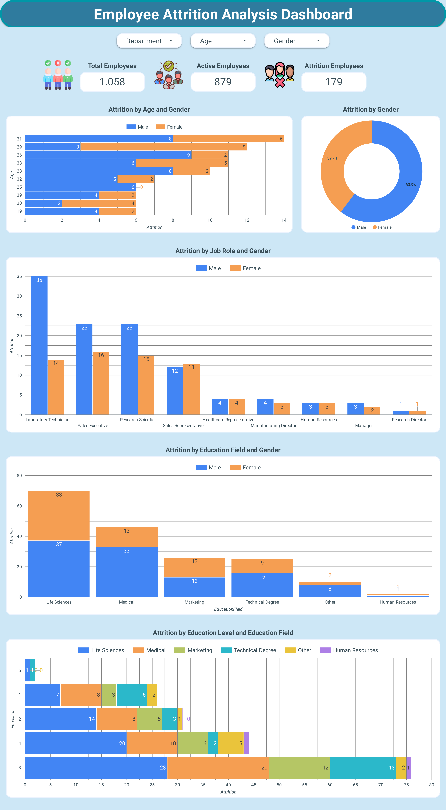
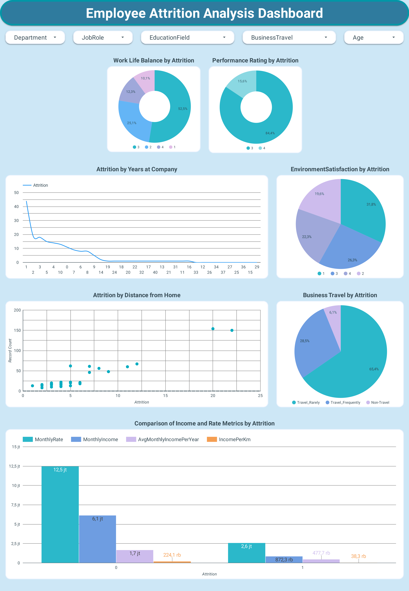

# **Proyek Akhir: Menyelesaikan Permasalahan Attrition Karyawan di Perusahaan Jaya Jaya Maju**

## **Business Understanding**

Jaya Jaya Maju adalah perusahaan multinasional yang telah berdiri sejak tahun 2000 dan memiliki lebih dari 1000 karyawan yang tersebar di seluruh Indonesia. Sebagai perusahaan yang cukup besar, Jaya Jaya Maju menghadapi tantangan signifikan dalam mengelola karyawan, yang tercermin dari tingginya attrition rate (rasio karyawan yang keluar dibandingkan total karyawan) yang mencapai lebih dari 10%.

Pendekatan berbasis data diperlukan untuk memahami pola attrition dan mengembangkan solusi yang dapat memitigasi risiko ini secara proaktif. Proyek ini akan memberikan insight yang actionable kepada  departemen Human Resources (HR) untuk mendukung pengambilan keputusan yang lebih baik.

### **Permasalahan Bisnis**
Jaya Jaya Maju menghadapi masalah tingginya *attrition rate* karyawan yang melebihi 10%. Kondisi ini menimbulkan kekhawatiran karena berdampak pada biaya operasional yang meningkat, penurunan produktivitas, dan ketidakstabilan organisasi. Departemen HR saat ini kesulitan memahami penyebab utama dari tingginya tingkat *attrition* ini dan membutuhkan solusi yang dapat membantu mereka mengelola masalah tersebut secara proaktif.

**Permasalahan Utama:**
- Belum diketahuinya faktor-faktor spesifik yang menyebabkan karyawan memilih untuk keluar dari perusahaan.
- Kurangnya alat atau sistem yang memungkinkan pemantauan berkala terhadap tren *attrition* dan faktor-faktor yang memengaruhinya.
- Dampak finansial dan operasional dari *attrition* yang tinggi belum dapat diminimalkan karena kurangnya wawasan berbasis data.

### **Cakupan Proyek**

Proyek ini mencakup beberapa tahapan utama untuk mengatasi permasalahan attrition:

1. **Business Understanding**  
   Memahami konteks bisnis dan dampak attrition terhadap perusahaan Jaya Jaya Maju .

2. **Data Understanding & Preparation**  
   Mengumpulkan dan mempersiapkan data karyawan, termasuk penanganan nilai hilang dan transformasi fitur.

3. **Exploratory Data Analysis (EDA)**  
   Menganalisis pola dan tren attrition berdasarkan variabel seperti usia, gaji, kepuasan kerja, dan lama bekerja.

4. **Modeling**  
   Membangun model prediktif seperti Logistic Regression, Random Forest, XGBoost, Gradient Boosting, Support Vector Machine (SVM), LightGBM, dan CatBoost untuk memprediksi risiko attrition.

5. **Evaluation**  
   Mengevaluasi performa model dengan metrik seperti akurasi, presisi, recall, dan F1-score.

6. **Script Prediction & Deployment Preparation**  
   Menyusun script prediksi otomatis dan menyimpan model terbaik untuk keperluan deployment.

7. **Dashboard Development**  
   Mengembangkan dashboard interaktif untuk memvisualisasikan insight dan metrik attrition secara real-time.

8. **Recommendation**  
   Memberikan rekomendasi strategis kepada  departemen Human Resources (HR) untuk meningkatkan retensi karyawan.


### **Persiapan Data**

#### 1. Sumber Dataset

- Dataset yang digunakan bersumber dari [ Employee Data (GitHub - Dicoding) ](https://github.com/dicodingacademy/dicoding_dataset/blob/main/employee/employee_data.csv). Dataset ini terdiri dari 1470 baris dan 35 kolom, mencakup informasi karyawan seperti:

   - **EmployeeId** : Identifier unik untuk setiap karyawan.

   - **Attrition** : Status apakah karyawan keluar dari perusahaan (0 = tidak, 1 = ya).

   - **Age** : Usia karyawan dalam tahun.

   - **BusinessTravel** : Frekuensi perjalanan bisnis yang dilakukan untuk pekerjaan (misalnya: tidak pernah, sesekali, sering).

   - **DailyRate** : Gaji harian karyawan.

   - **Department** : Departemen tempat karyawan bekerja (misalnya: HR, Sales, IT).

   - **DistanceFromHome** : Jarak dari rumah karyawan ke kantor dalam kilometer.

   - **Education** : Tingkat pendidikan karyawan, dengan skala: 1 = Below College, 2 = College, 3 = Bachelor, 4 = Master,5 = Doctor

   - **EducationField** : Bidang pendidikan karyawan (misal: teknik, bisnis, kesehatan).

   - **EnvironmentSatisfaction** : Tingkat kepuasan terhadap lingkungan kerja (1 = rendah sampai 4 = sangat tinggi).

   - **Gender** : Jenis kelamin karyawan.

   - **HourlyRate** : Gaji per jam karyawan.

   - **JobInvolvement** : Tingkat keterlibatan dalam pekerjaan (1 = rendah sampai 4 = sangat tinggi).

   - **JobLevel** : Level jabatan pekerjaan (1 sampai 5).

   - **JobRole** : Peran atau posisi pekerjaan karyawan.

   - **JobSatisfaction** : Tingkat kepuasan kerja (1 = rendah sampai 4 = sangat tinggi).

   - **MaritalStatus** : Status pernikahan karyawan.

   - **MonthlyIncome** : Gaji bulanan karyawan.

   - **MonthlyRate** : Tarif bulanan (mungkin digunakan untuk penghitungan tertentu, berbeda dengan MonthlyIncome).

   - **NumCompaniesWorked** : Jumlah perusahaan tempat karyawan pernah bekerja sebelumnya.

   - **Over18** : Apakah usia karyawan di atas 18 tahun (biasanya selalu 'Yes').

   - **OverTime** : Apakah karyawan sering lembur (Yes/No).

   - **PercentSalaryHike** : Persentase kenaikan gaji tahun lalu.

   - **PerformanceRating** : Penilaian kinerja (1 = rendah, 2 = baik, 3 = sangat baik, 4 = luar biasa).

   - **RelationshipSatisfaction** : Kepuasan hubungan dengan rekan kerja atau atasan (1 = rendah sampai 4 = sangat tinggi).

   - **StandardHours** : Jam kerja standar per minggu (biasanya tetap).

   - **StockOptionLevel** : Tingkat opsi saham yang dimiliki karyawan.

   - **TotalWorkingYears** : Total pengalaman kerja dalam tahun.

   - **TrainingTimesLastYear** : Jumlah pelatihan yang diikuti dalam setahun terakhir.

   - **WorkLifeBalance** : Tingkat keseimbangan antara pekerjaan dan kehidupan pribadi (1 = rendah sampai 4 = sangat baik).

   - **YearsAtCompany** : Lama bekerja di perusahaan saat ini dalam tahun.

   - **YearsInCurrentRole** : Lama berada di posisi/jabatan saat ini.

   - **YearsSinceLastPromotion** : Tahun sejak terakhir kali mendapat promosi.

   - **YearsWithCurrManager** : Lama bekerja di bawah manajer saat ini.


#### 2. Setup Environment

- Buat dan aktifkan environment Conda:
  ```
  conda create -n attrition-env python=3.12.7 -y
  conda activate attrition-env
  ```

- Install dependensi:
  ```
  pip install -r requirements.txt
  ```

#### 3. Prediksi Attrition dengan Model

- Jalankan script prediksi:
  ```
  python prediction.py
  ```

## **Business Dashboard**

### **Tujuan Dashboard**

- Memberikan gambaran menyeluruh tentang tingkat attrition.
- Menampilkan faktor kunci seperti usia, gaji, dan kepuasan kerja.
- Mendukung pengambilan keputusan strategis oleh departemen Human Resources (HR).

### **Visualisasi Dashboard**

Dashboard interaktif dibuat menggunakan Looker Studio, mencakup:
- Analisis attrition berdasarkan usia dan gender.
- Distribusi attrition berdasarkan gender.
- Analisis attrition berdasarkan bidang pendidikan dan gender.
- Analisis attrition berdasarkan peran pekerjaan dan gender.
- Analisis attrition berdasarkan tingkat pendidikan dan bidang pendidikan.
- Distribusi attrition berdasarkan keseimbangan kehidupan kerja.
- Distribusi attrition berdasarkan peringkat kinerja.
- Distribusi attrition berdasarkan kepuasan lingkungan.
- Distribusi attrition berdasarkan lama bekerja di perusahaan.
- Distribusi attrition berdasarkan jarak dari rumah.
- Distribusi attrition berdasarkan frekuensi perjalanan bisnis.
- Perbandingan metrik pendapatan dan peringkat berdasarkan attrition.

Lihat dashboard melalui tautan berikut:  
[](https://lookerstudio.google.com/reporting/a37815f8-7dd2-423e-a9bc-c761505877a5)





## **Kesimpulan**

Berdasarkan hasil analisis, tingkat attrition karyawan di perusahaan Jaya Jaya Maju mencapai 16,9%, angka yang tergolong cukup tinggi dan perlu mendapat perhatian serius. Faktor-faktor utama yang memengaruhi attrition antara lain usia muda, khususnya pada rentang 26–33 tahun, rendahnya kepuasan terhadap lingkungan kerja, kompensasi yang kurang kompetitif, serta jarak tempat tinggal yang jauh dari kantor. Menariknya, sebagian besar karyawan yang keluar justru memiliki kinerja yang tinggi dan mengaku memiliki work-life balance yang baik, sehingga kemungkinan besar alasan resign mereka berkaitan dengan kurangnya apresiasi, terbatasnya peluang pengembangan karier, atau budaya kerja yang kurang mendukung. Selain itu, frekuensi perjalanan dinas yang tinggi juga menjadi faktor risiko tambahan. Dalam hal prediksi, model CatBoost menunjukkan akurasi tertinggi sehingga dapat memberikan perkiraan yang akurat terhadap karyawan yang berpotensi keluar. Sementara itu, dashboard interaktif yang dikembangkan memungkinkan departemen Human Resources untuk melakukan pemantauan secara real-time dan mengambil tindakan preventif yang tepat.

### **Rekomendasi**

1. **Meningkatkan Kepuasan Kerja**: Meningkatkan kualitas lingkungan kerja melalui penyediaan fasilitas yang memadai, serta menyelenggarakan program pengembangan karyawan dan sesi umpan balik secara rutin.
2. **Kompensasi Kompetitif**: Tinjau ulang struktur gaji untuk menyesuaikan dengan standar industri.
3. **Dukungan Karyawan Baru**: Memberikan pelatihan intensif untuk karyawan dengan masa kerja pendek.
4. **Fleksibilitas Kerja**: Terapkan kebijakan kerja jarak jauh untuk karyawan yang tinggal jauh.
5. **Pemantauan Berkala**: Gunakan dashboard untuk mendeteksi tren attrition secara proaktif.

